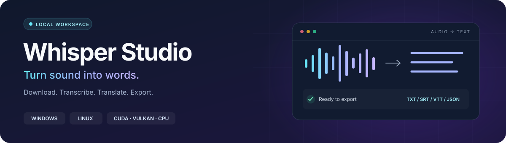
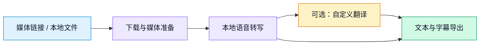

<p align="center">
  
</p>

<h1 align="center">Whisper Studio WebUI</h1>

<p align="center">
  <strong>音视频下载 · 本地转写 · 自定义翻译 · 字幕导出</strong><br>
  在浏览器里完成整个流程，让你的电脑承担转写工作。
</p>

<p align="center">
  <a href="#hardware"></a>
  <a href="#hardware"></a>
  <a href="#features"></a>
  <a href="https://github.com/sheno4/whisper-studio-webui/actions/workflows/bootstrap.yml"></a>
  <a href="LICENSE"></a>
</p>

<p align="center">
  <a href="#quick-start">快速开始</a> ·
  <a href="#features">功能概览</a> ·
  <a href="#hardware">硬件支持</a> ·
  <a href="#models">模型管理</a> ·
  <a href="#faq">常见问题</a>
</p>

转写在运行服务的机器上执行，媒体文件、模型和结果保存在本地。**启用自定义翻译时，字幕文本和提示词会发送到你配置的 API。** 默认访问地址为 `127.0.0.1`，局域网访问可按需开启。

<a id="quick-start"></a>

## 🚀 快速开始

准备好 **Git 和网络连接**，克隆后运行对应系统的启动脚本。

### Windows

```powershell
git clone https://github.com/sheno4/whisper-studio-webui.git
cd whisper-studio-webui
.\start-webui.bat
```

也可以直接双击项目中的 **`start-webui.bat`**。

### Linux

```bash
git clone https://github.com/sheno4/whisper-studio-webui.git
cd whisper-studio-webui
sh ./start-webui.sh
```

启动后打开 **[http://127.0.0.1:4317](http://127.0.0.1:4317)**，上传音视频或粘贴媒体链接即可创建任务。

> [!TIP]
> 启动脚本会复用可用工具，自动补齐 Node.js LTS、Python、FFmpeg、项目依赖及解析浏览器。基础环境准备完成后打开界面，模型在后台下载，转写任务会自动等待。
>
> 后续启动复用本地内容；更新源码后，启动脚本会检查依赖并按需重新构建。

无需提前安装 Node.js、Python 或 CUDA Toolkit，也不需要管理员权限。Linux 引导需要 `tar`、校验工具，以及 `curl` 或 `wget`；显卡驱动需要自行安装。

<a id="features"></a>

## ✨ 功能概览

| 📥 导入与下载 | 🎙️ 本地转写 |
| --- | --- |
| 上传、拖放音视频，或粘贴 YouTube、Bilibili、抖音等媒体链接。 | 支持 `faster-whisper`、`whisper.cpp` 和 `openai-whisper`，新安装按硬件选择后端。 |
| **⚡ 并行任务** | **🧩 模型管理** |
| 下载、转写和翻译独立调度，支持实时追加、进度推送、取消、重试和历史记录。 | 保存设置后后台准备模型，显示下载进度；支持取消、续传、重试及缓存复用。 |
| **🌐 自定义翻译** | **📄 字幕与文本** |
| 多套服务、独立密钥、默认服务、连接测试及提示词设置；无需密钥的接口可以留空。 | 导出 `TXT`、`SRT`、`VTT`、`JSON`，在 WebUI 中下载结果；服务端可打开输出目录、定位文件。 |



默认同时准备/下载 **3** 个任务、转写 **1** 个任务、翻译 **2** 个任务，每个下载最多使用 **8** 个连接。可在设置页调整；实际速度取决于硬件、网络和网站限制。

<details>
<summary><strong>展开：下载策略与并行处理</strong></summary>

- 支持 HTTP Range 的大文件分段并行下载，逐段续传、重试和校验；不支持范围读取时自动使用兼容方式。
- HLS/DASH 分片使用设置的下载并发数量。
- Bilibili 在同格式的官方主地址与备用 CDN 间采样选路，失败后切换线路继续下载。请求显式不继承电脑上的 HTTP/SOCKS 代理；路由器透明代理仍由其分流规则决定。
- 下载进度显示速度、大小和预计剩余时间；并行翻译共享同一服务的请求频率限制。
- Python 转写后端复用已加载模型；whisper.cpp 复用本地模型文件，每次转写启动原生 CLI。
- 取消一个任务不影响其他任务。显存充足时可增加转写并发；较大的模型会占用更多显存。

</details>

<a id="hardware"></a>

## 🖥️ 系统与硬件

支持 **Windows / Linux · x64 / ARM64**。新安装自动选用对应方案；已有的引擎和模型设置会保留。

| 平台 | 硬件 | 自动转写方案 | 运行条件 |
| --- | --- | --- | --- |
| Windows x64 | NVIDIA | faster-whisper · CUDA | Windows 10/11，兼容 CUDA 12 的驱动 |
| Windows x64 | AMD / Intel | whisper.cpp · Vulkan | 支持 Vulkan 的显卡和驱动 |
| Windows ARM64 | ARM64 设备 | whisper.cpp · CPU | Windows 11 ARM64；浏览器使用系统 Chromium 或 x64 模拟 |
| Linux x64 | AMD / Intel | whisper.cpp · Vulkan | glibc 2.35+，驱动提供 Vulkan ICD |
| Linux ARM64 | AMD / Intel | whisper.cpp · Vulkan | glibc 2.39+，Vulkan 驱动 |
| Linux x64 / ARM64 | NVIDIA | faster-whisper · CUDA | glibc 发行版、兼容驱动与对应 Python wheel |
| Windows / Linux | 无兼容 GPU，或强制 CPU | faster-whisper · CPU | Windows ARM64 使用 whisper.cpp CPU；首次按内存选择模型 |

**NVIDIA** 自动准备 CUDA 12 cuBLAS / cuDNN 9 运行库；**AMD / Intel** 通过 Vulkan 加速，无需安装 PyTorch ROCm。GPU 不可用时，相应后端会尝试 CPU。

Alpine/musl、32 位及其他架构需要自行提供兼容工具。Linux 浏览器还依赖发行版的基础图形库；浏览器缺库时，核心转写仍可使用。

<a id="models"></a>

## 🧩 模型管理

**设置 → 选择转写引擎和模型 → 保存。** 缺少的依赖和权重自动在后台准备，无需重启服务。

| 使用场景 | 行为 |
| --- | --- |
| 首次使用 / 新模型 | 显示准备与下载进度，转写任务等待就绪 |
| 切换回已下载模型 | 复用本地缓存，多个模型可以共存 |
| 连接中断 | 保留可用缓存与下载断点，在模型面板重试 |
| 取消下载 | 可在面板取消，需要时重新准备 |
| 修改设置时已有任务运行 | 已开始的任务保留原模型与 Python 环境，新任务使用新配置 |

首次模型下载可能需要数分钟，占用数百 MB 至数 GB；选择更大的模型时，请留出磁盘空间和显存。

<details>
<summary><strong>展开：后端与原生运行包</strong></summary>

### whisper.cpp

支持 tiny/base/small/medium、large-v1/v2/v3 和 turbo；`.en` 模型仅支持英语。distil 模型属于 faster-whisper，不能用于原生后端。

原生包由本仓库 GitHub Actions 从官方 whisper.cpp 源码构建，发布在[公开运行包页面](https://github.com/sheno4/whisper-studio-webui/releases/tag/whisper-runtime-v1.9.4)。安装器优先使用公开下载直链，不依赖 GitHub 登录或 API 配额，并验证发布的 SHA256。

项目 GPU 包不可访问时，会尝试官方 CPU 包。可通过 `WHISPER_CPP_PATH` 指定自己的 CLI，或通过 `WHISPER_CPP_MODEL_DIR` 指定 GGML 模型目录。私有发布源可复用 Git 凭据、`gh` 登录或 `WHISPER_GITHUB_TOKEN`。

### openai-whisper

在设置中选择并保存即可自动准备，也可启动时指定：

```powershell
.\start-webui.bat --backend=whisper
```

```bash
sh ./start-webui.sh --backend=whisper
```

该后端使用 PyTorch，GPU 支持取决于系统、硬件和安装的构建。

### NVIDIA 运行库

faster-whisper 的 CUDA 运行库独立于 PyTorch。若需要显式安装，可使用：

```bash
npm run setup -- --with-faster-cuda
```

</details>

<a id="accounts"></a>

## 🌐 翻译服务与登录

### 自定义翻译

在设置页添加 **服务名称、API 地址和模型**，启用并设为默认。需要认证时再填写 API Key；项目不提供内置付费套餐或 API 额度。

可配置多套服务、独立密钥、提示词、请求频率、分段长度和 Temperature，并在保存前测试连接。通过界面保存的密钥使用本机密钥加密。

### YouTube 会员视频

1. 在 Firefox 或 Chrome 中登录有对应会员权限的账号，确认能播放目标视频。
2. 打开 **设置 → 文件与默认行为 → YouTube 登录来源**。
3. 保持自动选择，或指定浏览器、配置目录、Netscape 格式的 `cookies.txt`。

Windows 下建议使用 Firefox；Chrome 的 Cookie 可能受系统加密保护或浏览器占用影响。自动模式优先尝试 Firefox，再检查 Chrome、已有 Cookie 文件，最后尝试公开访问。

浏览器登录信息仅在内存中使用，并限制为 YouTube/Google 域名；会员权限失败后不会转发到匿名第三方下载站。账号须具备对应内容的观看权限。

### 抖音与其他站点

公开抖音视频优先通过隔离的临时浏览器解析；受账号、地区或权限限制的内容仍可能需要 Cookie。其他需要登录的站点可使用项目根目录的 Netscape 格式 `cookies.txt`。

`cookies.txt` 已被 Git 忽略。非标准安装位置的 Chromium 可通过 `WHISPER_CHROMIUM_PATH` 指定。

<a id="advanced"></a>

## ⚙️ 进阶配置

默认配置可直接在本机使用。需要调整环境变量时，可复制 `.env.example` 为 `.env`。

<details>
<summary><strong>启动参数</strong></summary>

参数可传给 `start-webui.bat`、`sh ./start-webui.sh` 或 `npm run launch --`。

| 参数 | 用途 | `npm run setup --` 也支持 |
| --- | --- | :---: |
| `--cpu` | 本次强制 CPU，避免安装 GPU 库 | ✓ |
| `--backend=whisper.cpp` | 选择并保存后端；也可用 `faster-whisper`、`whisper` | ✓ |
| `--model=tiny` | 选择并保存模型；未指定时保留已有设置 | ✓ |
| `--skip-model` | 跳过启动预热，转写任务仍会按需准备模型 | ✓ |
| `--repair` | 重新安装依赖 | ✓ |
| `--setup-only` | 准备环境、模型和构建后退出 | — |
| `--rebuild` | 强制重建应用 | — |
| `--no-browser` | 启动后不自动打开界面 | — |
| `--skip-setup` | 跳过环境准备，适用于已手动准备完整环境的使用者 | — |

例如，提前准备使用所需的环境与模型：

```bash
sh ./start-webui.sh --setup-only --model=tiny
```

这一步需要联网下载缺少的内容；准备完成后退出。

</details>

<details>
<summary><strong>环境变量与自定义 Python</strong></summary>

| 变量 | 默认值 | 用途 |
| --- | --- | --- |
| `WHISPER_HOST` | `127.0.0.1` | Web 服务监听地址 |
| `WHISPER_PORT` | `4317` | 生产服务端口 |
| `WHISPER_PYTHON_PATH` | 项目内 `.venv` | 指定运行 Python |
| `WHISPER_CHROMIUM_PATH` | 自动检测 | 指定解析浏览器 |
| `WHISPER_OUTPUT_DIR` | `./outputs` | 任务输出目录 |
| `WHISPER_DATA_DIR` | `./.data` | 设置、日志、上传和本地密钥目录 |
| `WHISPER_MAX_UPLOAD_MB` | `10240` | 单个上传文件上限，单位 MB |
| `WHISPER_WEB_TOKEN` | 未设置 | 非本机监听时的访问令牌 |

`WHISPER_PYTHON_PATH` 和 `WHISPER_OUTPUT_DIR` 优先于已保存的设置。

自动新建环境使用 Python 3.14；可用的现有或自定义 Python 3.10+ 会保留，并在所选环境中检查依赖。失效的项目虚拟环境先保存到 `.runtime/venv-backups` 再重建；无效的自定义解释器会提示修正。

若要指定创建虚拟环境时使用的解释器：

```powershell
$env:WHISPER_BOOTSTRAP_PYTHON="C:\Path\To\python.exe"
npm run setup
```

移动项目后，旧的默认 Python 路径失效时，会尝试使用当前同名项目的 `.venv`，并迁移原默认输出路径；自定义输出目录保留。

</details>

<details>
<summary><strong>局域网访问</strong></summary>

非本机监听默认要求访问令牌。Windows 示例：

```powershell
$env:WHISPER_HOST="0.0.0.0"
$env:WHISPER_WEB_TOKEN="replace-with-a-long-random-token"
npm start
```

Linux 示例：

```bash
WHISPER_HOST=0.0.0.0 WHISPER_WEB_TOKEN=replace-with-a-long-random-token sh ./start-webui.sh
```

客户端第一次打开：

```text
http://SERVER_IP:4317/?token=replace-with-a-long-random-token
```

令牌会换为浏览器会话使用的 HttpOnly Cookie，并从地址栏移除。局域网 HTTP 可正常保存设置和复制字幕。

公网部署需要额外配置 HTTPS、反向代理、访问控制和防火墙；不要直接公开本服务端口。

</details>

<a id="faq"></a>

## 💡 常见问题

| 问题 | 处理方式 |
| --- | --- |
| 换模型需要重启吗？ | **不需要。** 保存后后台准备，任务自动等待；下载失败时在模型面板重试。 |
| 首次启动为什么较慢？ | 需要补齐基础环境并构建应用；模型随后在界面中后台下载，后续启动复用缓存。 |
| Python 或 FFmpeg 不可用？ | 重新运行启动脚本进行检查与修复；自定义 Python 请在设置中修正路径。 |
| GPU 初始化失败？ | 后端会尝试其他计算模式或 CPU；检查驱动，也可启动时传 `--cpu`。 |
| 抖音解析浏览器无法运行？ | 检查启动日志；Linux 可能缺少图形基础库，非标准路径可用 `WHISPER_CHROMIUM_PATH` 指定。 |
| 链接下载失败？ | 检查目标页面能否播放、账号权限和 Cookie；必要时升级所选 Python 中的 yt-dlp。 |
| 翻译未执行？ | 添加并启用翻译服务，设为默认，并确认任务启用了翻译。 |
| 文件夹在另一台电脑打开了？ | 输出目录位于运行服务的机器上；远程客户端可通过 WebUI 下载导出文件。 |

<a id="development"></a>

## 🛠️ 开发与项目结构

已有可用 Node.js 环境时，可运行开发模式：

```bash
npm install
npm run setup
npm run dev
```

开发界面地址为 **[http://127.0.0.1:5173](http://127.0.0.1:5173)**。

| 命令 | 用途 |
| --- | --- |
| `npm start` / `npm run launch` | 自动准备环境、按需构建并启动生产 WebUI |
| `npm run setup` | 准备 Python 环境、依赖、工具和所选模型 |
| `npm run dev` | 同时启动 Vite 界面和 API 开发服务 |
| `npm run check` | TypeScript 检查 |
| `npm run build` | 构建 WebUI 和 Node 服务 |
| `npm test` | 接口、队列、翻译、模型、链接解析与 Python 回归测试 |

<details>
<summary><strong>展开：架构与目录</strong></summary>

```text
React + Vite WebUI
        │ REST + Server-Sent Events
        ▼
Node.js / Express server
        │ JSON over stdin/stdout
        ├─ 后台环境与模型准备
        └─ 并行媒体准备 → 转写进程池 → 并行翻译
                  │
                  └─ yt-dlp / HTTP / FFmpeg
                     faster-whisper / whisper.cpp / openai-whisper
```

```text
src/renderer/           React WebUI
src/server/             HTTP、SSE、上传和静态资源
src/main/               任务、模型准备、环境、翻译与存储
src/shared/             前后端共享类型与链接解析
python/                 媒体 worker 与模型下载
scripts/                自动安装、运行工具与启动入口
.runtime/               便携工具、模型与缓存
.venv/                  默认 Python 环境
.data/                  本机设置、历史、日志与上传
outputs/                任务结果
```

</details>

<a id="privacy"></a>

## 🔐 数据与隐私

| 内容 | 默认保存位置 / 数据流向 |
| --- | --- |
| 上传音视频 | `.data/uploads` |
| 文本、字幕及任务结果 | `outputs` |
| 设置与历史记录 | `.data/settings.json` |
| 通过界面保存的 API Key | AES-256-GCM 加密；本机密钥位于 `.data/secret.key` |
| 自定义翻译请求 | 字幕文本与提示词发送至所选 API 服务 |

配置文件与 `.data/secret.key` 需要一起保护。默认运行时、模型、数据、输出、Cookie 和 `.env` 已由 `.gitignore` 排除；使用自定义目录时，请自行确认 Git 忽略规则。

## 📜 开源许可

项目采用 **[MIT License](LICENSE)**。

请只下载、转写和发布你有权处理的内容，并遵守目标站点的服务条款和当地法律。

<p align="center">
  <a href="#quick-start">开始使用</a> ·
  <a href="https://github.com/sheno4/whisper-studio-webui/issues">反馈问题</a> ·
  <a href="https://github.com/sheno4/whisper-studio-webui/releases/tag/whisper-runtime-v1.9.4">原生运行包</a>
</p>
